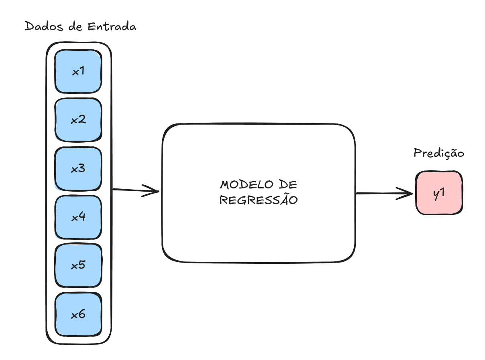
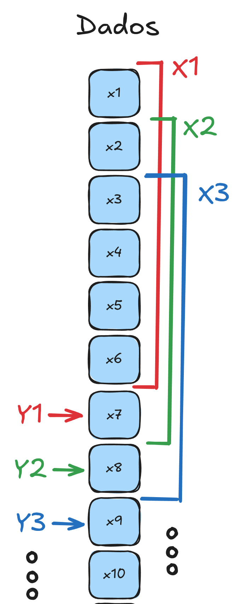
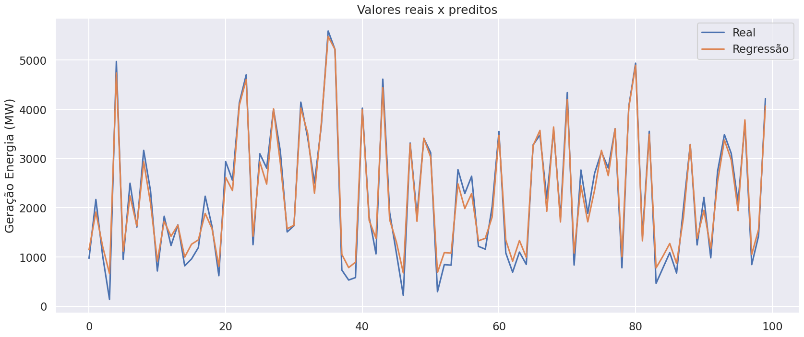
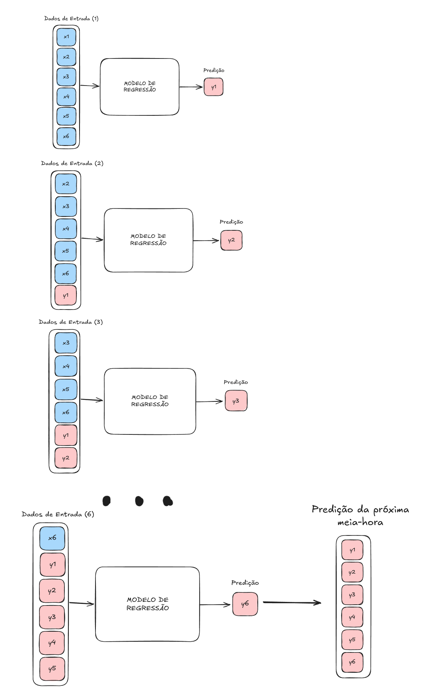
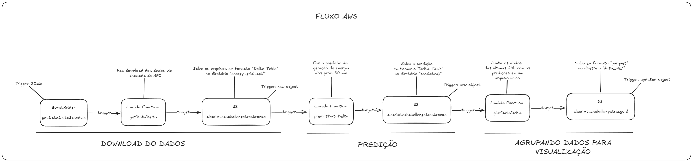

**[Vídeo explicativo no youtube](https://youtu.be/M67wFBs1goM)**

> Grid Status API has a 1 million rows per month limit on the free plan.

Fonte dos Dados: https://www.gridstatus.io/datasets/caiso_fuel_mix

> Use `poetry install` para garantir que tudo funcione como deveria

# SOBRE O PROJETO

### 1. Obtenção dos dados

#### Sobre os dados

A fonte de dados escolhida para este projeto foi a [GridStatus](https://www.gridstatus.io/) que disponibiliza uma plataforma analítica de dados sobre a indústria de energia. 

Dentre os vários dados disponíveis no site, foi escolhido o "*CAISO Fuel Mix*" onde temos dados, em intervalos de 5 minutos, sobre a geração de energia no estado da Califórnia. Mais informações [sobre a CAISO](https://en.wikipedia.org/wiki/California_Independent_System_Operator) e [sobre a fonte de dados utilizada](https://www.gridstatus.io/datasets/caiso_fuel_mix).

A tabela de dados possui informações sobre a geração de energia de diversas fontes:

- Solar
- **Eólica**
- Geotérmica
- Biomassa
- Biogás
- Hidro
- Carvão
- Nuclear
- Gás Natural
- Baterias
- Importação
- Outras

foi selecionada a fonte de energia eólica para a realização deste trabalho.

#### Download dos dados para treino do modelo de regressão

A consulta pode ser feita via API disponibilizada pela GridStatus. Para que as sazonalidades estejam representadas na amostra, foi feito download de um período de um ano - *de outubro de 2023 a outubro de 2024*.

Por se tratar de uma extração única, o código foi criado, em Python, através de um Jupyter Notebook. Está disponível no GitHub do projeto no caminho `notebooks/00_dados_historicos.ipynb`. 

A extração dos dados foi feita mês a mês e salva em formato csv no diretório `data/raw`. Após, um tratamento preliminar foi feito seguido da unificação de todos os dados em uma planilha única disponível em `data/staged/dados_empilhados.csv`.

Para mais detalhes sobre, consultar o código.

### 2. Treinando o modelo

#### Escolha do modelo

Dentre os diversos modelos disponíveis para um modelo de regressão, foi escolhido o Support Vector Regression (SVR) - *modelo amplamente utilizado para regressão de séries históricas não-lineares*.

A geração de energia eólica é influenciada por diversos fatores, como velocidade e direção do vento, temperatura e condições atmosféricas, que frequentemente apresentam relações não lineares. O SVR, particularmente quando combinado com kernels como o RBF (Radial Basis Function), é capaz de **capturar complexidades não lineares** além de possui uma boa **robustez a ruídos** nos dados.

#### Preparação dos dados

Como cada observação diz respeito à energia gerada dentro de um intervalo de 5 minutos e o objetivo é prever a próxima meia-hora de geração de energia eólica, **a janela de observação, ou o intervalo, será uma sequência de 6 observações**.

Para preparar os dados para o treino do modelo, a série histórica foi dividida em vários intervalos subsequentes de 6 observações onde a próxima observação após esse intervalo é o valor esperado (*target*).

O algoritmo analisará o comportamento de 6 observações para predizer qual será **o próximo valor**, ou seja, qual é a previsão da geração de energia eólica **dos próximos 5 minutos**.

Resumindo: O modelo receberá uma entrada com **6 observações**, ou seja, uma janela de 30 minutos de geração de energia para predizer qual será qual será a produção de energia dos **próximos 5 minutos**. 

Com os dados prontos, foi feita uma última divisão onde 80% das observações foram destinadas ao treino e 20% para o teste.

Para saber mais detalhes de toda a implementação, dê uma olhada nos códigos:

- `notebooks/02_criando_dados_treino_teste.ipynb`
- `notebooks/03_modelo_preditivo.ipynb`

### 3. Performance do modelo

A métrica escolhida para analisar a performance do modelo foi a Raiz do Erro Quadrático Médio (RMSE) por oferecer as seguintes vantagens:

- Penalização de grandes erros.
- Unidade interpretável.
- Indicação clara da precisão geral do modelo.

Além disso, foi criado um **modelo baseline** utilizando a classe `DummyRegressor` da biblioteca Scikit Learn para comparar o desempenho entre eles. Um modelo baseline serve como referência para avaliar se o modelo preditivo realmente agrega valor ao problema. Ele é um modelo simples que utiliza regras triviais para prever os valores e geralmente não considera relações complexas nos dados.

Com o RMSE e o modelo baseline podemos avaliar o desempenho geral do modelo e também se o modelo está realmente aprendendo padrões significativos.

Analisando os dados, temos os seguintes valores da sua distribuição:

- Média = $2464,31$
- Desvio Padrão = $1432,95$

Fazendo o cálculo do RMSE para os dado de teste do modelo, foi obtido o resultado de $193,92$. Como o RMSE está menor do que o desvio padrão da distribuição dos dados, verifica-se que o modelo está bem ajustado e o desempenho está satisfatório.

Abaixo está uma ilustração de como o modelo ajustado aos dados se comporta em uma amostra de 100 observações.

Agora vamos para a comparação com o `DummyRegressor`. Utilizando a estratégia padrão onde prediz o valor médio da variável alvo (target) para todos os exemplos no conjunto de dados, o valor do RMSE obtido foi de $1432,81$ (*quase o mesmo valor do desvio padrão da distribuição!*). Em outras palavras, um valor $638,88$ % maior do que o RMSE do modelo SVR.

Com estes resultados em mãos, concluí-se que o modelo possui um desempenho satisfatório e com uma confiabilidade dentro dos limites da distribuição dos dados. Assim sendo, podemos prosseguir para o desenvolvimento da aplicação.

Para saber mais detalhes de toda a implementação, dê uma olhada nos códigos:

- `notebooks/03_modelo_preditivo.ipynb`

### 4. Aplicação

O objetivo final do projeto é prever a próxima meia-hora de geração de energia eólica, para isso, precisamos extrapolar 6 vezes onde cada extrapolação leva em consideração a anterior. A ideia do funcionamento está ilustrado abaixo:

Para criar essa aplicação, foi criada uma arquitetura em Cloud utilizando os serviços da Amazon AWS composta pelos seguintes componentes (10 no total):

- `Lambda Function`
	- `getData`
	- `predictData`
	- `glueData`
- `Elastic Container Registry`
	- `tech-challenge-tres-get-data`
	- `tech-challenge-tres-glue-data`
	- `tech-challenge-tres-predict-data`
- `Event Bridge`
	- `getDataSchedule`
- `S3`
	- `alecrimtechchallengetresbronze`
	- `alecrimtechchallengetressilver`
	- `alecrimtechchallengetresgold`

Os arquivos com os modelos de regressão e o normalizador foram carregados no container `alecrimtechchallengetressilver` para uso das `Lambda Functions` como veremos a seguir.

O fluxo é o seguinte:

1. O `getDataSchedule` dispara um evento a cada 30 minutos
2. Esse evento é um gatilho que ativa a função `getData`
3. A função `getData` faz uma requisição à API do GridStatus dos dados da última meia-hora e salva no container `alecrimtechchallengetresbronze`
4. Ao salvar os dados, o container disparará um evento que, por sua vez, irá "*triggar*" a função `predictData`
5. A função `predictData` utilizará os últimos dados obtidos para predizer qual será a geração de energia eólica dos próximos 30 minutos utilizando o modelo de regressão treinado e armazenado no `alecrimtechchallengetresbronze`
6. Ao salvar os dados, o container disparará um evento que, por sua vez, irá "*triggar*" a última função `glueData`
7. A função `glueData` gerará um arquivo único contendo os dados das últimas 24h e os próximos 30 minutos preditos. Este arquivo será salvo no container `alecrimtechchallengetresgold`

**NOTA: A extensão utilizada para armazenar os arquivos é "parquet".**

A implementação descrita pode ser justificada pela adoção de uma abordagem orientada a dados (data-driven) para apoiar a tomada de decisões no setor de energia renovável, especificamente no monitoramento e previsão da geração de energia eólica. Essa estrutura oferece benefícios significativos, incluindo:

1. **Tomada de Decisão Proativa e Otimizada**
    - A previsão da geração de energia eólica para os próximos 30 minutos permite que operadores de rede ou gestores de energia ajustem rapidamente a alocação de recursos.
    - Isso inclui decisões sobre compra e venda de energia no mercado spot, ativação de fontes de energia suplementares ou ajustes em contratos de fornecimento.

2. **Resiliência e Eficiência Operacional**
    - A geração de arquivos consolidados com os dados das últimas 24 horas e previsões futuras facilita o monitoramento contínuo e a identificação de padrões.
    - Esta visão integrada ajuda a detectar desvios, planejar manutenção preventiva e responder a eventos inesperados com maior rapidez.

3. **Apoio à Sustentabilidade e ao Cumprimento Regulatório**
    - A previsão precisa de geração eólica contribui para integrar fontes renováveis de forma eficiente na matriz energética, reduzindo a dependência de fontes não renováveis.
    - O histórico consolidado e as previsões podem ser utilizados para relatórios regulatórios e demonstração de conformidade ambiental.

4. **Automatização e Escalabilidade**
    - O pipeline automático descrito elimina processos manuais, reduzindo erros e permitindo que a solução escale para lidar com fluxos de dados maiores ou mais frequentes.
    - A arquitetura baseada em eventos oferece flexibilidade para adaptações e integrações com outras fontes de dados ou modelos preditivos.

5. **Melhoria Contínua e Feedback ao Modelo**
    - A coleta contínua de dados históricos e predições fornece um ciclo de feedback para aprimorar os modelos preditivos ao longo do tempo, aumentando a acurácia e a confiabilidade.

Essa abordagem não apenas promove uma operação mais eficiente e sustentável, mas também alinha a estratégia de gerenciamento energético com princípios de inovação tecnológica e inteligência artificial.

Para saber mais detalhes de toda a implementação, dê uma olhada nos códigos:

- `lambda_functions/get_data/lambda_function.py`
- `lambda_functions/predict_data/lambda_function.py`
- `lambda_functions/glue_data/lambda_function.py`
